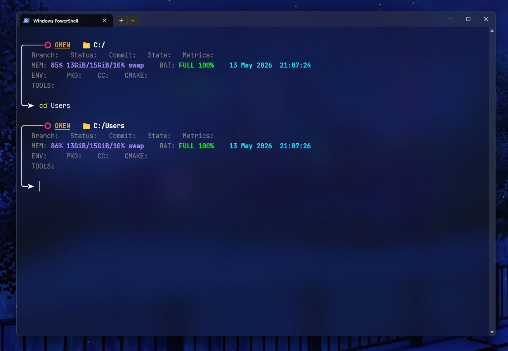
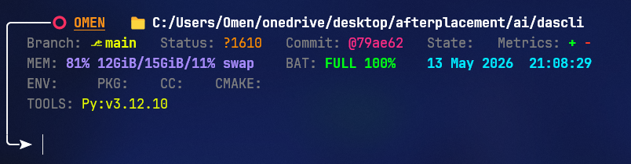

<div align="center">

# 🚀 Starship TOML Configuration for Windows 11

A modern, minimal, and highly customized terminal setup powered by  
[Starship](https://starship.rs/?utm_source=chatgpt.com)

Designed for developers who want a **clean**, **aesthetic**, and **information-rich** command line experience.

[](https://www.microsoft.com/windows/windows-11)
[](https://learn.microsoft.com/powershell/)
[](https://starship.rs/)
[](https://www.nerdfonts.com/font-downloads)

</div>

---

# 🖼️ Preview

## 🌌 Overall Terminal Look

<div align="center">



</div>

---

## 🌿 GitHub Repository View

<div align="center">



</div>

---

# 📦 Installation

## 1️⃣ Install Starship

Follow the official installation guide:

👉 [Starship Installation Guide](https://starship.rs/installing/?utm_source=chatgpt.com)

### Windows Installation (Winget)

```powershell
winget install Starship.Starship
```

---

## 2️⃣ Configure PowerShell

Open your PowerShell profile:

```powershell
notepad $PROFILE
```

Add the following line:

```powershell
Invoke-Expression (&starship init powershell)
```

---

## 3️⃣ Install Nerd Font

Download and install Nerd Fonts from:

👉 [Nerd Fonts](https://www.nerdfonts.com/font-downloads?utm_source=chatgpt.com)

### Recommended Font

- **JetBrainsMono Nerd Font**

---

## 4️⃣ Change Terminal Font

Inside **Windows Terminal**:

1. Click the **Down Arrow (⌄)** near the tab bar
2. Open **Settings**
3. Select your preferred terminal profile:
   - PowerShell
   - CMD
   - WSL
4. Navigate to:
   - **Appearance**
5. Change:
   - **Font Face → JetBrainsMono Nerd Font**

---

## 5️⃣ Add Configuration File

Place the `starship.toml` file inside:

```text
C:\Users\<YourUser>\.config\
```

Example:

```text
C:\Users\OMEN\.config\starship.toml
```

---

# 🧩 Modules Included

| Module | Description |
|---|---|
| 📂 Directory | Current working directory |
| 🌿 Git Branch | Active branch |
| 🔖 Git Commit | Latest commit hash |
| 🧠 Memory Usage | RAM usage visibility |
| 🔋 Battery | Battery percentage/status |
| 🕒 Time | Current time and date |

---

# 🎯 Purpose

This configuration was created to provide:

- Better development workflow
- Cleaner CLI visibility
- Minimal but informative prompts
- Modern terminal aesthetics
- Faster access to development context

Perfect for:

- 👨‍💻 Software Engineers
- 🤖 AI/ML Developers
- ☁️ DevOps Engineers
- ⚙️ Backend Developers
- 🐧 Linux/Terminal Enthusiasts

---

# 🔥 Recommended Setup

This configuration works best with:

- Windows 11
- Windows Terminal
- PowerShell 7+
- Git Bash
- WSL2
- Python Environments

---

# 📚 Documentation

## 🌟 Starship Documentation

👉 [Starship Docs](https://starship.rs/guide/?utm_source=chatgpt.com)

## ⚙️ Configuration Reference

👉 [Starship Configuration Reference](https://starship.rs/config/?utm_source=chatgpt.com)

---

# 💡 Customization

You can customize:

- Colors
- Icons
- Modules
- Prompt format
- Shell integrations
- Performance optimizations

Directly from the `starship.toml` file.

---

# ⭐ Support

If you like this setup:

- ⭐ Star the repository
- 🍴 Fork the project
- 🛠️ Customize your own version

---

<div align="center">

## 🚀 Enjoy Your Fancy Terminal Setup

Built with ❤️ using  
[Starship](https://starship.rs/?utm_source=chatgpt.com)

</div>
